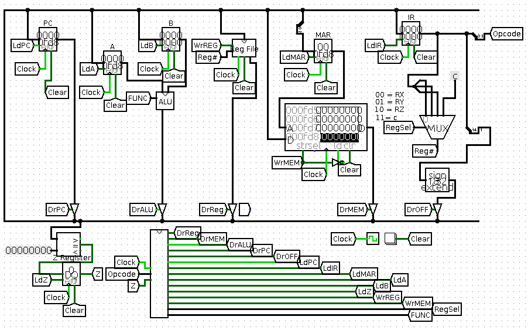
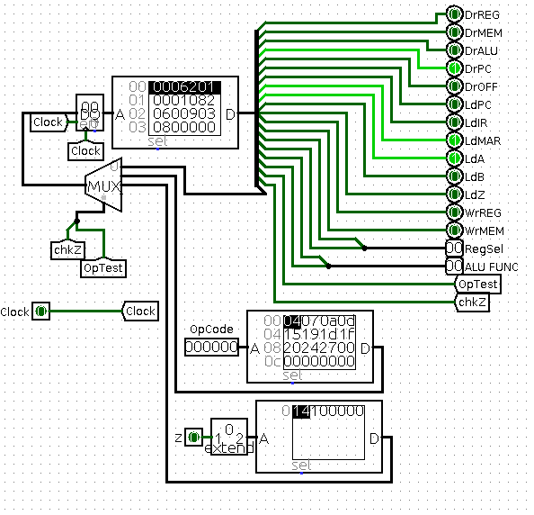
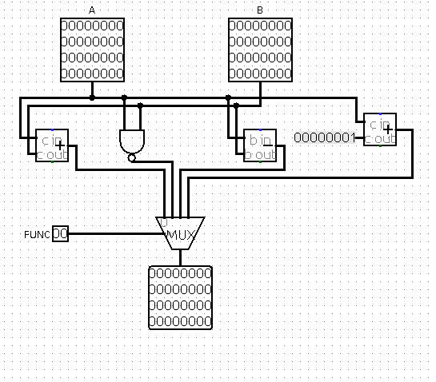
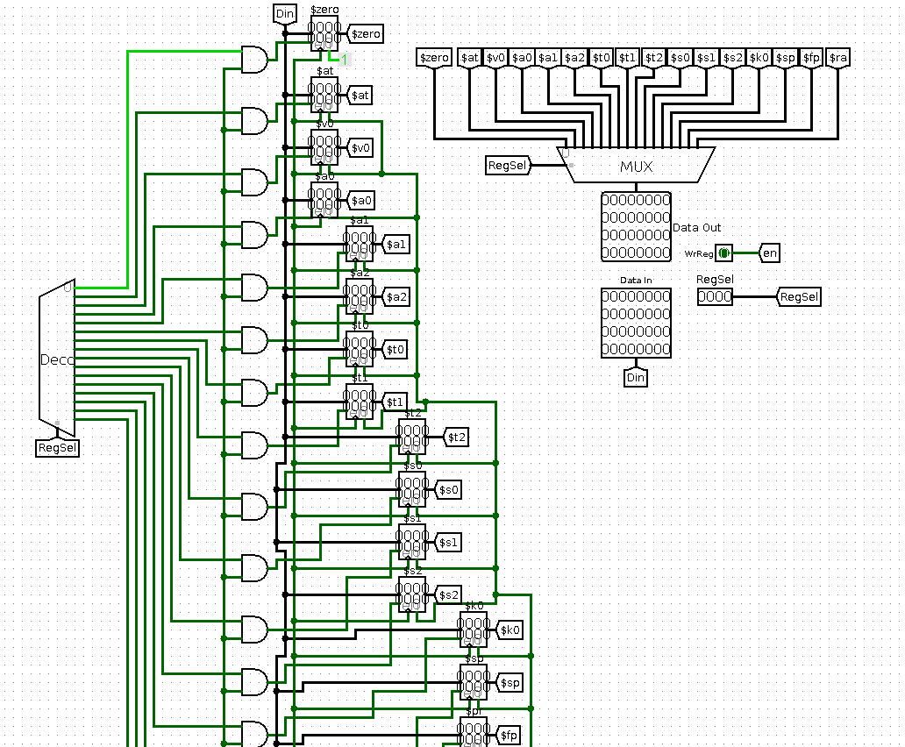

# LC 2200 Computer
Instruction Set Architecture (ISA), Multi-Cycle Processor (Datapath), and Interrupt (HW & Microcontroller support)

This project is a part of assignment in CS 2200 (Systems and Networks)

more detail : [Project I Instruction](project1.pdf), [Project II Instruction](project2.pdf)

### Processor 


### State Machine


### ALU


### Register


### Assembly Program (prj2.s)
```
!************************************************************************!
!	!
! general calling convention:	!
!	!
! (1) Register usage is as implied in the assembler names	!
!	!
! (2) Stack convention	!
!	!
!	 The stack grows towards higher addresses.  The stack pointer	!
!	 ($sp) points to the next available (empty) location.	!
!	!
! (3) Mechanics	!
!	!
!	 (3a) Caller at call time:	!
!	      o  Write any caller-saved stuff not saved at entry to	!
!	 space on the stack that was reserved at entry time.	!
!	      o  Do a JALR leaving the return address in $ra	!
!	!
!	 (3b) Callee at entry time:	!
!	      o  Reserve all stack space that the subroutine will need	!
!	 by adding that number of words to the stack pointer,	!
!	 $sp.	!
!	      o  Write any callee-saved stuff ($ra) to reserved space	!
!	 on the stack.	!
!	      o  Write any caller-saved stuff if it makes sense to	!
!	 do so now.	!
!	!
!	 (3c) Callee at exit time:	!
!	      o  Read back any callee-saved stuff from the stack ($ra)	!
!	      o  Deallocate stack space by subtract the number of words !
!	 used from the stack pointer, $sp	!
!	      o  return by executing $jalr $ra, $zero.	!
!	!
!	 (3d) Caller after return:	!
!	      o  Read back any caller-saved stuff needed.	!
!	!
!************************************************************************!

!vector table
 vector0: .fill 0x00000000 !0
 .fill 0x00000000 !1
 .fill 0x00000000 !2
 .fill 0x00000000
 .fill 0x00000000 !4
 .fill 0x00000000
 .fill 0x00000000
 .fill 0x00000000
 .fill 0x00000000 !8
 .fill 0x00000000
 .fill 0x00000000
 .fill 0x00000000
 .fill 0x00000000
 .fill 0x00000000
 .fill 0x00000000
 .fill 0x00000000 !15
!end vector table


main:
addi $sp, $zero, initsp ! initialize the stack pointer
lw $sp, 0($sp)
! Install timer interrupt handler into the vector table
addi $a0, $zero, ti_inthandler 
addi $a1, $zero, vector0 
sw $a0, 1($a1)
ei !Don't forget to enable interrupts...

addi $a0, $zero, 2	!load base for pow
addi $a1, $zero, 4	!load power for pow
addi $at, $zero, POW	!load address of pow
jalr $at, $ra	!run pow
halt	

POW: 
  addi $sp, $sp, 2   ! push 2 slots onto the stack
  sw $ra, -1($sp)   ! save RA to stack
  sw $a0, -2($sp)   ! save arg 0 to stack
  beq $zero, $a1, RET1 ! if the power is 0 return 1
  beq $zero, $a0, RET0 ! if the base is 0 return 0
  addi $a1, $a1, -1  ! decrement the power
  la $at, POW	! load the address of POW
  jalr $at, $ra   ! recursively call POW
  add $a1, $v0, $zero  ! store return value in arg 1
  lw $a0, -2($sp)   ! load the base into arg 0
  la $at, MULT	! load the address of MULT
  jalr $at, $ra   ! multiply arg 0 (base) and arg 1 (running product)
  lw $ra, -1($sp)   ! load RA from the stack
  addi $sp, $sp, -2  ! pop the RA and arg 0 off the stack
  jalr $ra, $zero   ! return
RET1: addi $v0, $zero, 1  ! return a value of 1
  addi $sp, $sp, -2
  jalr $ra, $zero
RET0: add $v0, $zero, $zero ! return a value of 0
  addi $sp, $sp, -2
  jalr $ra, $zero	
MULT: add $v0, $zero, $zero ! zero out return value
AGAIN: add $v0,$v0, $a0  ! multiply loop
  addi $a1, $a1, -1
  beq $a1, $zero, DONE ! finished multiplying
  beq $zero, $zero, AGAIN ! loop again
DONE: jalr $ra, $zero	

ti_inthandler:
addi $sp, $sp, 15
sw $k0, 0($sp)	!save $k0
ei !enable interrupts
sw $at, -1($sp)
sw $v0, -2($sp)
sw $a0, -3($sp)
sw $a1, -4($sp)
sw $a2, -5($sp)
sw $a3, -6($sp)
sw $a4, -7($sp)
sw $s0, -8($sp)
sw $s1, -9($sp)
sw $s2, -10($sp)
sw $s3, -11($sp)
sw $k0, -12($sp)
sw $fp, -13($sp)
sw $ra, -14($sp)

!execute the code
addi $a0, $zero, time !get the time location
lw $a0, 0($a0) !t0 contains mem location of time
lw $a1, 0($a0) 
lw $s1, 1($a0) 
lw $s2, 2($a0) 

seconds:	
addi $a1, $a1, 1 ! increment second
addi $s0, $a1, -60 
beq $s0, $zero, minutes ! increment a minute
beq $zero, $zero, storevalues !store values otherwise

minutes:
addi $a1, $zero, 0 !make the second zero
addi $s1, $s1, 1 !increment minutes
addi $s0, $s1, -60 
beq $s0, $zero, hours	
beq $zero, $zero, storevalues	!store values otherwise

hours:
addi $s1, $zero, 0 !make the minute zero
addi $s2, $s2, 1 !increment hour
addi $s0, $s1, -24 
beq $s0, $zero, hoursreset
beq $zero, $zero, storevalues

hoursreset:
addi $s2, $zero, 0 !make the hours zero

storevalues:
sw $a1, 0($a0) !store incremented seconds into seconds location.
sw $s1, 1($a0) !store minutes
sw $s2, 2($a0) !store hours

!restore processor registers
lw $k0, -0($sp)
lw $at, -1($sp)
lw $v0, -2($sp)
lw $a0, -3($sp)
lw $a1, -4($sp)
lw $a2, -5($sp)
lw $a3, -6($sp)
lw $a4, -7($sp)
lw $s0, -8($sp)
lw $s1, -9($sp)
lw $s2, -10($sp)
lw $s3, -11($sp)
lw $k0, -12($sp)
lw $fp, -13($sp)
lw $ra, -14($sp)
addi $sp, $sp, -15	
di !disable interrupt
reti !return from interrupt

time: 	.fill 0xFFFFC 
	.fill 0xFFFFD 
	.fill 0xFFFFE 
initsp: .fill 0xA00000
```


### How to Run
1. open 'logism-generic-2.7.1.jar' 

2. File -> Open... 

3. Navigate to jaemin_baek-processor.circ

4. Load instruction
